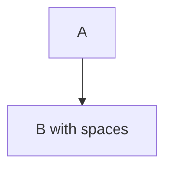

# Mermaid Diagram Review Skill

Review Mermaid diagrams for syntax validity, clarity, consistency, and common issues.

## Syntax Validation

### Valid Diagram Types

- **Supported**: `flowchart`, `sequenceDiagram`, `classDiagram`, `stateDiagram-v2`, `erDiagram`, `gantt`, `pie`, `gitGraph`
- **Validate** proper diagram declaration (e.g., `flowchart TD`, `sequenceDiagram`)

### Node Syntax

1. **Proper arrows**: `-->`, `-.->`, `==>`, `--text-->`, `-.text.->`, `==text==>`
2. **Brackets**: Round `()`, Box `[]`, Stadium `([])`, Subroutine `[[]]`, Cylinder `[()]`, Circle `(())`, Asymmetric `>]`, Rhombus `{}`
3. **Labels**: Use quotes for spaces/special chars

❌ **Bad**:

```mermaid
flowchart TD
    A --> B with spaces
```

✅ **Good**:



### Direction

1. **Valid**: `TD`/`TB` (top-down), `LR` (left-right), `RL` (right-left), `BT` (bottom-top)
2. **Default**: `TD` if not specified

### Quoted Labels

1. Use `"label"` for spaces: `A["User Input"]`
2. Use `"label"` for special chars: `B["API: /users"]`
3. Escape quotes inside: `C["Say \"Hello\""]`

## Clarity Checks

### Readable Labels

1. **Concise**: 2-5 words ideal
2. **Descriptive**: Clear action/state
3. **Consistent**: Same terminology throughout

❌ **Bad**: `A["This is a very long label that describes the process of user authentication and validation"]`
✅ **Good**: `A["Authenticate User"]`

### Logical Flow

1. **Direction**: Consistent top→bottom or left→right
2. **No backtracking**: Minimize upward/backward arrows
3. **Entry/Exit**: Clear start and end points

### Complexity

1. **Node count**: <20 nodes ideal, >30 consider splitting
2. **Nesting**: Max 3 levels of subgraphs
3. **Connections**: <5 connections per node

### Proper Grouping

1. Use `subgraph` for related nodes
2. Name subgraphs meaningfully
3. Close all subgraphs with `end`

## Style Consistency

### Consistent Node Shapes

1. **Same purpose = same shape**: All decisions as rhombus `{}`
2. **Process**: Box `[]`
3. **Start/End**: Stadium `([])`
4. **Data**: Cylinder `[()]`

❌ **Bad**: Mixed shapes for same purpose
✅ **Good**: All decisions use `{decision}`, all processes use `[process]`

### Consistent Arrow Types

1. **Solid `-->`**: Standard flow
2. **Dotted `-.->`**: Optional/async flow
3. **Bold `==>`**: Primary/critical path
4. **Labeled**: Use consistently `--label-->`

### Proper Styling

1. **classDef**: Define reusable styles
2. **class**: Apply to nodes
3. **Example**:

```mermaid
classDef errorClass fill:#f96,stroke:#333
A:::errorClass
```

### Accessibility-Friendly Colors

1. **Contrast**: >4.5:1 for text
2. **Avoid**: Red/green only for status (colorblind-friendly)
3. **Use**: Shapes + colors for distinction

## Common Issues

### Missing Quotes

❌ `A --> B with spaces`
✅ `A --> B["with spaces"]`

### Invalid Arrow Syntax

❌ `A -> B` (use `-->`)
❌ `A -- > B` (no spaces)
✅ `A --> B`

### Circular Dependencies

1. **Detect**: A→B→C→A loops
2. **Fix**: Add exit conditions or break cycle

### Unclosed Subgraphs

❌ Missing `end` after `subgraph`
✅ Every `subgraph` has matching `end`

## Review Output Format

````markdown
### Mermaid Diagram Review: [filename]

#### Syntax Issues
1. [Issue description] - Line X

#### Clarity Improvements
1. [Suggestion with reasoning]

#### Style Inconsistencies
1. [Inconsistency found]

#### Recommended Changes
```mermaid
[corrected diagram]
```
````

## Context Variables

- `files`: List of file paths containing Mermaid diagrams
- `pr_number`: Pull request number (if applicable)
- `focus`: Specific aspect to review (`syntax`, `clarity`, `style`, `all`)
