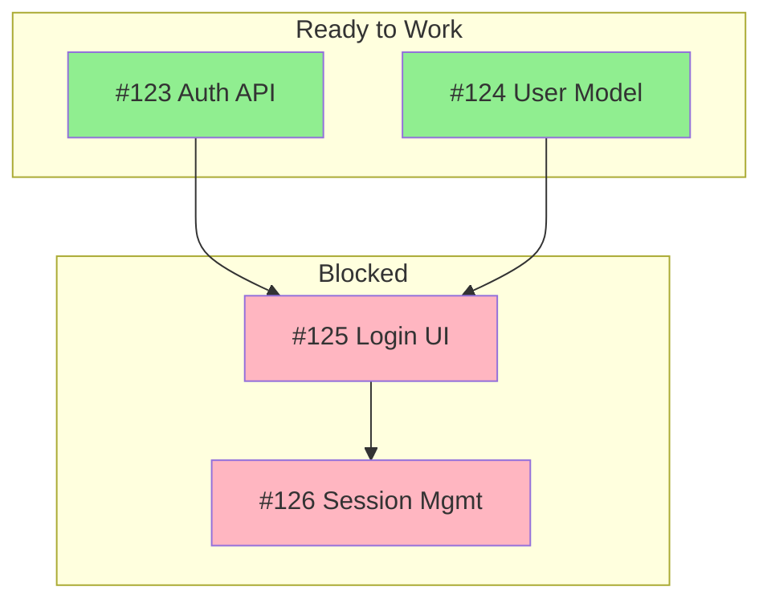
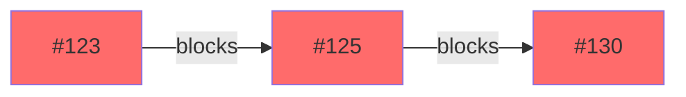

# GitHub Issue Relationship Mapper

Map relationships between GitHub issues to support planning, identify blockers,
and find the critical path.

## Skills to Load

Invoke the Skill `planner:planning-with-github` for GitHub integration guidance.

## Process

### Step 1: Fetch Issue Data

Use the issue-analyzer agent or fetch directly:

```bash
gh issue list --state open --json number,title,body,labels --limit 200
```

### Step 2: Extract Dependencies

Parse each issue body for dependency patterns:

**Blocked By Patterns** (this issue depends on):

- `blocked by #(\d+)`
- `depends on #(\d+)`
- `waiting on #(\d+)`
- `requires #(\d+)`
- `after #(\d+)`
- `prerequisite: #(\d+)`

**Blocks Patterns** (this issue is a dependency):

- `blocks #(\d+)`
- `blocking #(\d+)`
- `prerequisite for #(\d+)`
- `required by #(\d+)`

**Cross-Reference Patterns**:

- Simple `#(\d+)` references (weaker signal)
- URL references to issues

### Step 3: Build Dependency Graph

Create an adjacency list:

```json
{
  "123": {
    "title": "Auth API",
    "blocks": [125, 126],
    "blockedBy": [],
    "status": "ready"
  },
  "125": {
    "title": "Login UI",
    "blocks": [130],
    "blockedBy": [123, 124],
    "status": "blocked"
  }
}
```

### Step 4: Analyze Graph

**Identify Node Types**:

- **Root Nodes**: Issues with no blockers (can start now)
- **Leaf Nodes**: Issues that block nothing (end points)
- **Hub Nodes**: Issues with many dependencies (high impact)
- **Blocked Nodes**: Issues waiting on others

**Find Critical Path**:

1. Start from leaf nodes
2. Trace back through blockedBy relationships
3. Find longest chain = critical path
4. Calculate total estimated effort on critical path

**Detect Issues**:

- Circular dependencies (A blocks B blocks A)
- Long chains (>5 issues deep)
- High-fan-out issues (blocks many)

### Step 5: Generate Visualizations

**Mermaid Dependency Graph**:



**Critical Path Highlight**:



### Step 6: Generate Report

## Output Format

````markdown
## Issue Dependency Analysis

**Repository**: {repo}
**Date**: {date}
**Issues Analyzed**: {count}

### Summary

| Metric                | Count |
| --------------------- | ----- |
| Total Issues          | X     |
| Ready (no blockers)   | X     |
| Blocked               | X     |
| Circular Dependencies | X     |

### Dependency Graph

```mermaid
{mermaid_diagram}
```
````

### Critical Path

The longest dependency chain:

1. #123 Auth API (~3 days)
2. #125 Login UI (~5 days)
3. #130 User Dashboard (~4 days)

**Total Critical Path Duration**: ~12 days

### Ready Issues (Can Start Now)

| #   | Title      | Blocks   | Priority |
| --- | ---------- | -------- | -------- |
| 123 | Auth API   | 125, 126 | P1       |
| 124 | User Model | 125      | P1       |

### Blocked Issues

| #   | Title    | Blocked By | Est. Unblock |
| --- | -------- | ---------- | ------------ |
| 125 | Login UI | 123, 124   | ~3 days      |

### Hub Issues (High Impact)

Issues that block many others - prioritize these:

| #   | Title    | Blocks Count | Priority |
| --- | -------- | ------------ | -------- |
| 123 | Auth API | 3            | P1       |

### Parallel Work Streams

Independent work that can proceed simultaneously:

**Stream 1**: #123 → #125 → #130
**Stream 2**: #140 → #145 (independent)
**Stream 3**: #150 (standalone)

### Issues Detected

#### Circular Dependencies

#### Long Chains (>5 deep)

{list or "None detected"}

### Recommendations

1. Prioritize hub issues (#123) to unblock multiple streams

2. Consider breaking up long chains
3. Address circular dependencies immediately

## Error Handling

- If no dependencies found: Report clean dependency state
- If circular dependency: Highlight clearly with affected issues
- If issue not found in repo: Note as external/closed reference

## Notes

1. Focus on explicit dependency statements, not all #NNN references. Simple
   mentions often aren't true dependencies; over-reporting clutters analysis.
2. Consider issue state. Closed issues don't block; including them creates
   phantom dependencies.
3. Report confidence level when dependencies are inferred. Uncertain dependencies
   need validation before acting on them.
4. Suggest adding explicit dependency labels when unclear. Explicit labels
   enable automated dependency tracking.
