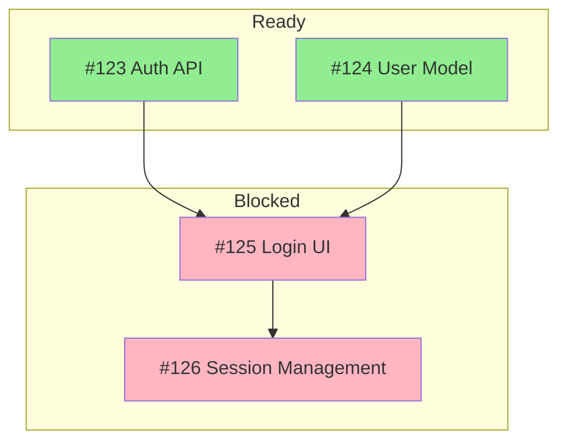

# GitHub Planning Integration

Analyze and process GitHub issues for project planning, prioritization, and roadmap integration.

## Prerequisites

- **GitHub CLI (gh)**: Required - must be installed and authenticated
  - Install: `brew install gh` (macOS), `winget install GitHub.cli` (Windows), or see [cli.github.com](https://cli.github.com)
  - Authenticate: `gh auth login`
- **jq**: Optional - for advanced JSON filtering in staleness detection
- **Mermaid support**: Optional - for dependency graph visualization

## GitHub CLI Commands

### Fetching Issues

```bash
# List all open issues
gh issue list --state open --json number,title,labels,milestone,body,comments,createdAt,updatedAt

# List with limit
gh issue list --limit 100 --json number,title,labels,body

# Filter by label
gh issue list --label "feature" --json number,title,labels,body

# Filter by milestone
gh issue list --milestone "v1.0" --json number,title,labels,body

# Get specific issue
gh issue view <number> --json number,title,body,labels,comments,state,assignees,linkedPullRequests
```

### Issue JSON Fields

| Field                | Description        | Planning Use           |
| -------------------- | ------------------ | ---------------------- |
| `number`             | Issue number       | Reference ID           |
| `title`              | Issue title        | Description            |
| `body`               | Issue description  | Details, dependencies  |
| `labels`             | Applied labels     | Priority, type, effort |
| `milestone`          | Assigned milestone | Timeline grouping      |
| `assignees`          | Assigned users     | Resource planning      |
| `comments`           | Discussion thread  | Context, estimates     |
| `linkedPullRequests` | Related PRs        | Implementation status  |
| `createdAt`          | Creation date      | Age analysis           |
| `updatedAt`          | Last update        | Activity analysis      |

## Label Interpretation

### Priority Labels

| Label Pattern                      | Priority | RICE Boost | MoSCoW      |
| ---------------------------------- | -------- | ---------- | ----------- |
| `P0`, `critical`, `blocker`        | Highest  | +50%       | Must Have   |
| `P1`, `high-priority`, `important` | High     | +25%       | Should Have |
| `P2`, `medium`, `normal`           | Medium   | 0          | Could Have  |
| `P3`, `low`, `nice-to-have`        | Low      | -25%       | Could Have  |

### Type Labels

| Label Pattern            | Type          | Considerations                                |
| ------------------------ | ------------- | --------------------------------------------- |
| `bug`, `defect`          | Bug           | Affects existing users, often higher priority |
| `feature`, `enhancement` | Feature       | New functionality                             |
| `tech-debt`, `refactor`  | Technical     | Long-term maintenance                         |
| `docs`, `documentation`  | Documentation | Support and onboarding                        |
| `security`               | Security      | Usually critical priority                     |
| `performance`            | Performance   | User experience impact                        |

### Effort Labels

| Label Pattern               | Effort      | Person-Days | RICE Effort |
| --------------------------- | ----------- | ----------- | ----------- |
| `XS`, `trivial`, `< 1 hour` | Extra Small | 0.25        | 0.5         |
| `S`, `small`, `1-4 hours`   | Small       | 0.5-1       | 1           |
| `M`, `medium`, `1-2 days`   | Medium      | 1-2         | 2           |
| `L`, `large`, `3-5 days`    | Large       | 3-5         | 5           |
| `XL`, `epic`, `1+ week`     | Extra Large | 5-10        | 10          |

### Status Labels

| Label Pattern        | Status       | Action                  |
| -------------------- | ------------ | ----------------------- |
| `blocked`, `waiting` | Blocked      | Check blocker           |
| `ready`, `groomed`   | Ready        | Can be scheduled        |
| `in-progress`, `wip` | In Progress  | Already being worked    |
| `needs-triage`       | Needs Triage | Requires prioritization |
| `stale`              | Stale        | Consider closing        |

## Dependency Extraction

### Patterns in Issue Body

Search for dependency patterns:

```regex
# Blocks/blocked patterns
blocked by #(\d+)
depends on #(\d+)
waiting on #(\d+)
requires #(\d+)
after #(\d+)

# Blocking patterns
blocks #(\d+)
blocking #(\d+)
prerequisite for #(\d+)
```

### Linked Issues

Parse cross-references:

```regex
# Direct references
#(\d+)

# URL references
github\.com/[\w-]+/[\w-]+/issues/(\d+)
```

### Building Dependency Graph

1. Fetch all issues
2. Extract dependency patterns from body/comments
3. Build adjacency list:

   ```json
   {
     "123": { "blocks": [456, 789], "blockedBy": [111] },
     "456": { "blocks": [], "blockedBy": [123] }
   }
   ```

4. Identify:
   - Root nodes (no blockers)
   - Leaf nodes (blocks nothing)
   - Critical paths (longest chains)
   - Circular dependencies (errors)

### Mermaid Dependency Visualization



## Issue Analysis

### Complexity Signals

Indicators of high complexity:

1. **Long body** - Extensive description (>500 words)
2. **Many comments** - Extended discussion (>10 comments)
3. **Multiple labels** - Crosses concerns
4. **No estimate label** - Unclear effort
5. **Multiple dependencies** - Integration complexity
6. **Long age** - Possibly unclear/hard problem

### Staleness Detection

```bash
# Issues not updated in 30 days
gh issue list --json number,title,updatedAt | \
  jq '[.[] | select(.updatedAt < (now - 2592000 | todate))]'
```

### Activity Score

Calculate issue activity score:

```text
Activity = (comments × 2) + (reactions × 1) + (updates × 0.5)
```

Higher activity may indicate:

- User demand
- Complexity (lots of discussion)
- Ambiguity (need for clarification)

## Milestone Integration

### Fetching Milestones

```bash
# List milestones
gh api repos/{owner}/{repo}/milestones --jq '.[] | {number, title, due_on, open_issues, closed_issues}'
```

### Milestone Analysis

1. **Progress**: closed_issues / (open_issues + closed_issues)
2. **Due Date**: Days until milestone due
3. **Scope**: Total issues in milestone
4. **Risk**: Low progress + near due date = high risk

### Roadmap Mapping

Map milestones to roadmap phases:

```text
Milestone "v1.0 MVP" → Phase 1: Core Features
Milestone "v1.1 Polish" → Phase 2: Stabilization
Milestone "v2.0 Major" → Phase 3: Major Features
```

## Pull Request Integration

### Linked PRs

```bash
# Get PRs linked to issue
gh issue view <number> --json linkedPullRequests
```

### PR Status Interpretation

| Status    | Meaning     | Issue Impact      |
| --------- | ----------- | ----------------- |
| No PR     | Not started | Need to schedule  |
| Draft PR  | In progress | Actively worked   |
| Review PR | Almost done | Near completion   |
| Merged PR | Complete    | Can close issue   |
| Closed PR | Abandoned   | Need reassessment |

## Output Formats

### Issue Summary Table

```markdown
| #   | Title      | Priority | Effort | Status  | Blocks | Blocked By |
| --- | ---------- | -------- | ------ | ------- | ------ | ---------- |
| 123 | Auth API   | P1       | M      | Ready   | 125    | -          |
| 124 | User Model | P1       | S      | Ready   | 125    | -          |
| 125 | Login UI   | P0       | L      | Blocked | 126    | 123, 124   |
```

### Priority Matrix

```markdown
## P0 - Critical (Do Now)

- #125 Login UI [L] - Blocked by #123, #124

## P1 - High (Do Next)

- #123 Auth API [M] - Ready
- #124 User Model [S] - Ready

## P2 - Medium (Plan)

- #127 Profile Page [M] - Ready

## P3 - Low (Backlog)

- #128 Dark Mode [S] - Nice to have
```

### Dependency Report

```markdown
## Dependency Analysis

### Critical Path

#123 → #125 → #126 (3 issues, ~2 weeks)

### Ready Issues (No Blockers)

- #123 Auth API
- #124 User Model

### Blocked Issues

- #125 Login UI - Waiting on: #123, #124
- #126 Session Management - Waiting on: #125

### Circular Dependencies

None detected
```

## Best Practices

1. **Use consistent labeling** - Inconsistent labels cause issues to be
   misprioritized or missed entirely during planning.
2. **Document dependencies in issues** - Use standard patterns. Undocumented
   dependencies lead to blocked work discovered mid-sprint.
3. **Keep milestones updated** - Stale milestones mislead stakeholders and
   invalidate roadmap projections.
4. **Close stale issues** - A cluttered backlog wastes triage time and obscures
   actual priorities.
5. **Link PRs to issues** - Unlinked PRs break status tracking and make
   progress invisible.
6. **Use issue templates** - Missing information forces follow-up questions
   that delay prioritization.
7. **Regular triage** - Untriaged issues accumulate and create planning blind
   spots.
8. **Automate where possible** - Manual labeling is error-prone and doesn't
   scale.
