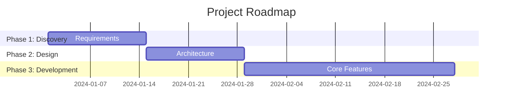

---

name: planner:roadmapping
description: Creates project roadmaps with phases, milestones, and dependencies. Invoked when user asks to create a roadmap, plan project phases, define milestones, or map out a project
---

# Roadmapping

Creates structured project roadmaps with phases, milestones, deliverables, and dependencies.

## Prerequisites

- **Mermaid support**: Optional - for Gantt chart visualization

## Roadmap Components

1. **Goal** - Ultimate objective
2. **Phases** - Major stages (3-6 typical)
3. **Milestones** - Key checkpoints with success criteria
4. **Deliverables** - Concrete outputs
5. **Dependencies** - What blocks what
6. **Risks** - Per-phase concerns with mitigations

## Phase Sizing Guide

| Duration    | Phases |
| ----------- | ------ |
| < 1 month   | 2-3    |
| 1-3 months  | 3-4    |
| 3-6 months  | 4-5    |
| 6-12 months | 5-6    |

## Typical Phase Distribution

| Phase         | Effort % |
| ------------- | -------- |
| Discovery     | 10-15%   |
| Design        | 15-20%   |
| Implementation| 40-50%   |
| Stabilization | 15-20%   |
| Launch        | 5-10%    |

## Output Template

```markdown
### Phase N: [Name]

**Objective**: [What this phase achieves]
**Duration**: [Estimated duration]
**Prerequisites**: [What must be complete first]

#### Milestones
1. [Milestone] - [Success criteria]

#### Deliverables
1. [Deliverable] - [Description]

#### Dependencies
- Depends on: [Phase/external]
- Blocks: [What this blocks]

#### Risks
| Risk | Probability | Impact | Mitigation |
|------|-------------|--------|------------|
```

## Gantt Chart (Mermaid)



## Milestone Quality Checklist

- [ ] Specific - Single interpretation
- [ ] Measurable - Quantifiable criteria
- [ ] Achievable - Realistic given resources
- [ ] Relevant - Aligned with goal
- [ ] Time-bound - Has target date

## Review Criteria

1. **Goal Alignment** - Each phase contributes to goal?
2. **Completeness** - All phases and milestones defined?
3. **Feasibility** - Durations realistic?
4. **Clarity** - Success criteria clear?
5. **Flexibility** - Contingency buffers included?

## Best Practices

1. Start with success criteria before planning
2. Add buffers for unknowns (10-20%)
3. Document assumptions explicitly
4. Include decision points between phases
5. Review and update as conditions change
