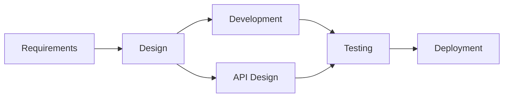
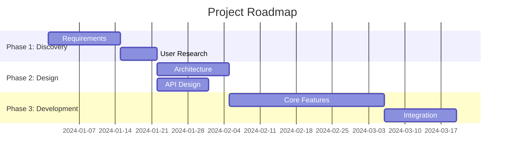

# Roadmapping Patterns

Create structured project roadmaps with phases, milestones, deliverables, and dependencies.

## Prerequisites

- **Mermaid support**: For Gantt chart visualization (optional but recommended)
- No external tools required for core functionality

## Roadmap Components

### Core Elements

1. **Goal** - The ultimate objective
2. **Phases** - Major stages of work
3. **Milestones** - Key checkpoints
4. **Deliverables** - Concrete outputs
5. **Dependencies** - What blocks what
6. **Risks** - Potential issues per phase

### Phase Structure

Each phase should include:

```markdown
### Phase N: [Name]

**Objective**: [What this phase achieves]
**Duration**: [Estimated duration]
**Prerequisites**: [What must be complete first]

#### Milestones

1. [Milestone] - [Success criteria]

#### Deliverables

1. [Deliverable] - [Description]

#### Dependencies

- Depends on: [Phase/external dependency]
- Blocks: [What this phase blocks]

#### Risks

| Risk | Probability | Impact | Mitigation |
| ---- | ----------- | ------ | ---------- |
```

## Phase Planning Patterns

### Typical Phase Breakdown

#### Software Development

1. **Discovery** (10-15%)
   - Requirements gathering
   - User research
   - Technical feasibility

2. **Design** (15-20%)
   - Architecture design
   - API design
   - UX design

3. **Implementation** (40-50%)
   - Core development
   - Integration
   - Testing

4. **Stabilization** (15-20%)
   - Bug fixes
   - Performance optimization
   - Documentation

5. **Launch** (5-10%)
   - Deployment
   - Monitoring setup
   - User communication

#### Product Launch

1. **Research & Planning**
2. **Development**
3. **Beta/Testing**
4. **Pre-launch**
5. **Launch**
6. **Post-launch**

### Phase Sizing

| Duration    | Recommended Phases      |
| ----------- | ----------------------- |
| < 1 month   | 2-3 phases              |
| 1-3 months  | 3-4 phases              |
| 3-6 months  | 4-5 phases              |
| 6-12 months | 5-6 phases              |
| > 12 months | Consider epic breakdown |

## Milestone Definition

### SMART Milestones

1. **Specific** - Clearly defined outcome
2. **Measurable** - Quantifiable success criteria
3. **Achievable** - Realistic given resources
4. **Relevant** - Aligned with project goal
5. **Time-bound** - Has a target date

### Milestone Types

1. **Deliverable Milestones**
   - "API v1 complete"
   - "User authentication deployed"

2. **Quality Milestones**
   - "90% test coverage achieved"
   - "Performance benchmarks met"

3. **Process Milestones**
   - "Design review approved"
   - "Security audit passed"

4. **External Milestones**
   - "Partner integration complete"
   - "Regulatory approval received"

### Milestone Template

```markdown
**Milestone**: [Name]
**Target Date**: [Date]
**Success Criteria**:

1. [Criterion 1]
2. [Criterion 2]
   **Verification Method**: [How to verify]
   **Owner**: [Responsible person/team]
```

## Dependency Management

### Dependency Types

1. **Finish-to-Start (FS)**
   - Most common
   - B cannot start until A finishes
   - Example: "Cannot deploy until tests pass"

2. **Start-to-Start (SS)**
   - B cannot start until A starts
   - Example: "Documentation starts when development starts"

3. **Finish-to-Finish (FF)**
   - B cannot finish until A finishes
   - Example: "Training completes when documentation completes"

4. **Start-to-Finish (SF)**
   - Rare
   - B cannot finish until A starts

### Dependency Visualization



### Dependency Analysis

1. Identify all dependencies
2. Check for circular dependencies
3. Find critical path (longest dependency chain)
4. Identify parallel work opportunities
5. Plan resource allocation

## Risk Assessment

### Risk Categories

1. **Technical Risks**
   - Technology unknowns
   - Integration challenges
   - Performance issues

2. **Resource Risks**
   - Team availability
   - Skill gaps
   - Budget constraints

3. **Schedule Risks**
   - Dependency delays
   - Scope creep
   - External blockers

4. **External Risks**
   - Third-party dependencies
   - Regulatory changes
   - Market changes

### Risk Matrix

```text
           │ Low Impact │ Med Impact │ High Impact
───────────┼────────────┼────────────┼────────────
High Prob  │   Medium   │    High    │  Critical
Med Prob   │    Low     │   Medium   │    High
Low Prob   │    Low     │    Low     │   Medium
```

### Risk Mitigation Strategies

1. **Avoid** - Eliminate the risk source
2. **Mitigate** - Reduce probability or impact
3. **Transfer** - Shift risk to third party
4. **Accept** - Acknowledge and monitor

## OKR Alignment

### Linking Roadmap to OKRs

Each phase should align with Objectives and Key Results:

```markdown
**Phase**: User Authentication

**Aligned Objective**: Improve user security and experience

**Key Results Impacted**:

1. KR1: Reduce account compromise rate by 50%
2. KR2: Decrease login time by 30%
3. KR3: Achieve 95% user satisfaction with login flow
```

### Phase-to-OKR Mapping

| Phase   | Primary OKR     | Secondary OKR |
| ------- | --------------- | ------------- |
| Phase 1 | O1: Security    | O3: UX        |
| Phase 2 | O2: Performance | O1: Security  |

## Visual Roadmap Formats

### Gantt Chart (Mermaid)



### Timeline Format

```text
Q1 2024          Q2 2024          Q3 2024
|───────────────|───────────────|───────────────|
[  Discovery   ][    Design    ][  Development ]
     M1              M2               M3
```

### Milestone Timeline

```text
Jan        Feb        Mar        Apr        May
 |          |          |          |          |
 ●──────────●──────────●──────────●──────────●
 M1         M2         M3         M4         M5
 Kickoff    Design     Beta       RC         GA
            Complete   Launch     Release
```

## Roadmap Review Criteria

When reviewing a roadmap, check:

1. **Goal Alignment**
   - Does each phase contribute to the goal?
   - Are there phases that don't add value?

2. **Completeness**
   - Are all necessary phases included?
   - Are milestones well-defined?
   - Are dependencies mapped?

3. **Feasibility**
   - Are durations realistic?
   - Are resources available?
   - Are risks addressed?

4. **Clarity**
   - Is success criteria clear?
   - Are deliverables specific?
   - Are owners assigned?

5. **Flexibility**
   - Are there contingency buffers?
   - Can phases be adjusted?
   - Are there decision points?

## Best Practices

1. **Start with the end** - Define success before planning. Roadmaps without
   clear success criteria drift and never reach completion.
2. **Involve the team** - Collaborative roadmapping surfaces hidden constraints
   and produces more accurate estimates.
3. **Plan for uncertainty** - Add buffers for unknowns. Plans without slack
   fail at the first unexpected obstacle.
4. **Document assumptions** - Implicit assumptions become surprise blockers
   when they prove false.
5. **Review regularly** - Roadmaps that don't evolve become fiction that
   misleads stakeholders.
6. **Communicate changes** - Stakeholders who learn of changes late lose trust
   and disengage.
7. **Track against plan** - Unmonitored roadmaps provide no early warning of
   schedule risk.
8. **Learn from retrospectives** - Repeating past estimation mistakes compounds
   planning debt.
